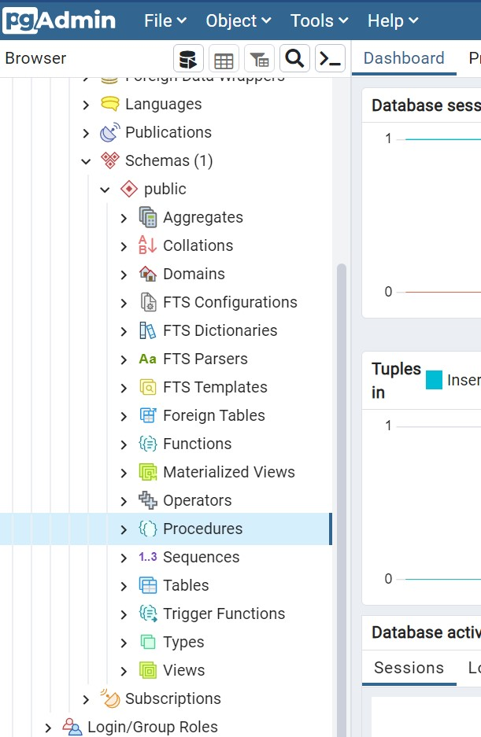
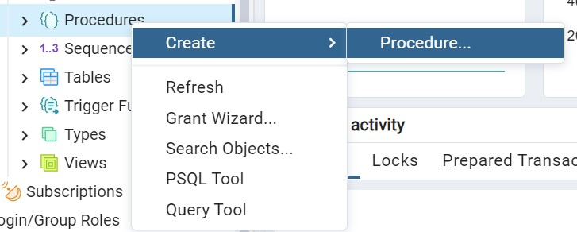
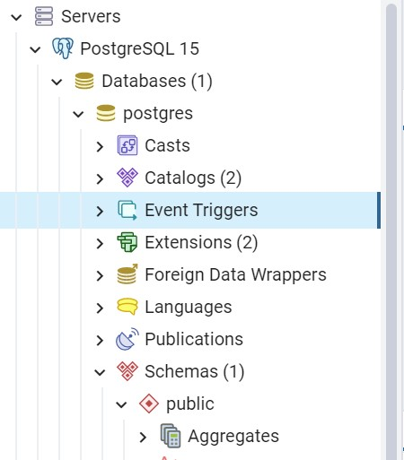
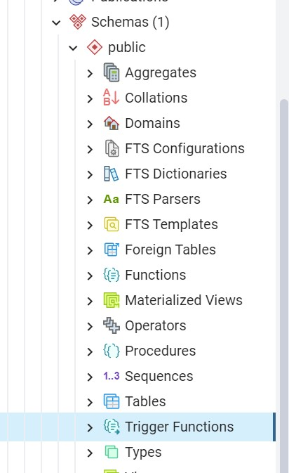

# Лабораторная работа №5. Использование пользовательских процедур, функций и триггеров в PostgreSQL

> **Цель работы:** Изучить пользовательские процедуры, функции и триггеры в базах данных, приобрести практические навыки создания хранимых процедур и триггеров в PostgreSQL.

## Средства выполнения

* СУБД PostgreSQL
* Средство администрирования pgAdmin

## Пункты задания для выполнения

1. Изучить теоретические сведения лабораторной работы.
2. Создать следующие хранимые процедуры и функции (в своей базе):
    * Процедуру для изменения данных таблицы.
    * Процедуру для вставки данных в таблицу.
    * Примеры арифметических функций из теоретической части лабораторной работы.
    * Функцию для поиска информации по названию компании.
    * Функцию для поиска товаров по диапазону цен.
    * Функцию для поиска заказов по дате заказа и/или диапазону дат заказа, доставки, в зависимости от введенных параметров.
    * Функции по заданию варианта.
3. Создать триггер INSERT.
4. Создать триггер DELETE.
5. Создать триггер UPDATE.
6. Создать триггер, который при удалении записи из таблицы Products сначала удаляет все связанные с ней записи из таблицы Items, а затем удаляет саму запись из таблицы Products.
7. Создать триггер, с использованием временной таблицы NEW.
8. Создать триггер DDL, который предотвратит удаление или изменение таблиц в базе данных.
9. Подготовиться к защите лабораторной работы (уметь написать собственную процедуру/триггер).

## Пользовательские процедуры

### Теоретическая часть

Пользовательская процедура в PostgreSQL – SQL-запрос или набор запросов, хранящийся на стороне БД. Хранимые процедуры реализуют динамические запросы, выполняемые на стороне сервера. Рассмотрим создание процедуры при помощи команд языка SQL (испльзуйте **Query Tool**).

Синтаксис создания процедуры:

```sql
CREATE [ OR REPLACE ] PROCEDURE
    name ( [ [ argmode ] [ argname ] argtype [ { DEFAULT | = } default_expr ] [, ...] ] )
{ LANGUAGE lang_name
    | TRANSFORM { FOR TYPE type_name } [, ... ]
    | [ EXTERNAL ] SECURITY INVOKER | [ EXTERNAL ] SECURITY DEFINER
    | SET configuration_parameter { TO value | = value | FROM CURRENT }
    | AS 'definition'
    | AS 'obj_file', 'link_symbol'
    | sql_body
  } ...
```

Процедуры принимают следующие параметры:

* имя — при необходимости укажите имя схемы.
* режим аргумента - Может быть IN, INOUT или VARIADIC. Значение по умолчанию — IN. Режим OUT не поддерживается. Вместо него используйте INOUT. VARDIAC — это неопределенное число входных аргументов одного типа. Они должны быть последними входными аргументами.
* имя аргумента.
* тип аргумента – тип данных аргумента.
* выражение по умолчанию - выражение, которое будет использоваться, если параметр не указан. Входные параметры, следующие за параметром со значением по умолчанию, также должны иметь значения по умолчанию. Если значение default определено, процедуру можно выполнить без указания значения соответствующего параметра.
* имя языка — язык, используемый для написания процедуры. Допускается значение sql, c, internal или имя определяемого пользователем процедурного языка, например plpgsql.
* тип данных параметра - тип данных аргумента. Тип может быть базовым, составным или доменным, либо это может быть ссылка на столбец таблицы.

Хранимые процедуры могут быть запущены следующей командой:

```sql
CALL <Имя процедуры> (<Параметр1>, <Параметр2>, …)
```

Здесь <Имя процедуры> – имя выполняемой процедуры;
<Параметр1>, <Параметр2>, ... – значения параметров.

При вызове процедуры значение каждого из объявленных параметров должно быть указано пользователем, если для параметра не определено значение по умолчанию или значение не задано равным другому параметру. Параметры являются локальными в пределах процедуры; в разных процедурах могут быть использованы одинаковые имена параметров.

### Пример

1. Создание хранимой процедуры, которая вставляет данные в таблицу
Студенты:

    ```sql
    CREATE PROCEDURE ins_student (surname varchar(), sname varchar(), secname varchar(), snumber varchar(), group varchar(),    maths int, physics int, programming int)
        LANGUAGE SQL
        AS $$
            INSERT INTO students VALUES (surname, sname, secname, snumber, group, maths, physics, programming);
        $$;
    ```

    Команда вызова этой процедуры выглядит следующим образом:

    ```sql
    CALL ins_student('Сидоров', 'Иван', 'Петрович', '18У137', 'ИУ5-95Б', 2, 4, 4);
    CALL ins_student('Котиков', 'Василий', 'Афанасьевич','ИУ5-92Б', '18У127', 5, 4, 5);
    ```

    Проверить результат работы можно запросом: `select * from students;`

2. Создание и вызов процедуры без параметров:

    ```sql
    CREATE OR REPLACE PROCEDURE hello_world()
        LANGUAGE plpgsql
        AS $$
            BEGIN
            RAISE NOTICE 'Hello, World!';
            END;
        $$;
    CALL hello_world();
    ```

3. Создание и вызов процедуры с выходными параметрами:

    ```sql
    CREATE OR REPLACE PROCEDURE get_stats(
        INOUT total INT,
        INOUT avg NUMERIC
    )
        LANGUAGE plpgsql
        AS $$
            BEGIN
            -- Считаем общее количество заказов
            SELECT COUNT(*) INTO total FROM orders;
            -- Вычисляем среднее количесво единиц в заказе
            SELECT AVG(qty) INTO avg FROM orders;
            -- Если данных нет, устанавливаем 0
            IF avg IS NULL THEN avg := 0;
            END IF;
            END;
        $$;
    CALL get_stats (NULL, NULL);
    ```

Для работы с хранимыми процедурами в обозревателе объектов нужно выбрать папки «Schemas - Public - Procedures» базы данных.



Создадим процедуру, обновляющую данные по оценкам после пересдачи. Для создания новой хранимой процедуры нужно щелкнуть правой кнопкой мыши по папке «Procedures» и в появившемся меню выбрать пункт «Create». Появится окно создания новой хранимой процедуры.



Создать процедуру вида:

```sql
CREATE PROCEDURE retake (m int, num varchar())
LANGUAGE SQL
AS $$
     UPDATE students SET maths = m WHERE snumber = num;
   $$;
```

Команда вызова:

```sql
CALL retake( 5, '18У137' );
```

## Функции

### Теоретическая часть

SQL-функции выполняют произвольный список операторов SQL и возвращают результат последнего запроса в списке. В простом случае (не с множеством) будет возвращена первая строка результата последнего запроса. Если последний запрос вообще не вернёт строки, будет возвращено значение NULL.

Кроме того, можно объявить SQL-функцию как возвращающую множество (то есть, несколько строк), указав в качестве возвращаемого типа функции SETOF некий_тип, либо объявив её с указанием RETURNS TABLE(столбцы). В этом случае будут возвращены все строки результата последнего запроса.

Тело SQL-функции должно представлять собой список SQL-операторов, разделённых точкой с запятой. Точка с запятой после последнего оператора может отсутствовать. Если только функция не объявлена как возвращающая void, последним оператором должен быть SELECT, либо INSERT, UPDATE или DELETE с предложением RETURNING.

Любой набор команд на языке SQL можно скомпоновать вместе и обозначить как функцию.

Команда CREATE FUNCTION определяет новую функцию. CREATE OR REPLACE FUNCTION создаёт новую функцию, либо заменяет определение уже существующей.

```sql
CREATE [ OR REPLACE ] FUNCTION
    имя ( [ [ режим_аргумента ] [ имя_аргумента ] тип_аргумента [ { DEFAULT | = } выражение_по_умолчанию ] [, ...] ] )
    [ RETURNS тип_результата
      | RETURNS TABLE ( имя_столбца тип_столбца [, ...] ) ]
  { LANGUAGE имя_языка
    | TRANSFORM { FOR TYPE имя_типа } [, ... ]
    | WINDOW
    | { IMMUTABLE | STABLE | VOLATILE }
    | [ NOT ] LEAKPROOF
    | { CALLED ON NULL INPUT | RETURNS NULL ON NULL INPUT | STRICT }
    | { [ EXTERNAL ] SECURITY INVOKER | [ EXTERNAL ] SECURITY DEFINER }
    | PARALLEL { UNSAFE | RESTRICTED | SAFE }
    | COST стоимость_выполнения
    | ROWS строк_в_результате
    | SET параметр_конфигурации { TO значение | = значение | FROM CURRENT }
    | AS 'определение'
    | AS 'объектный_файл', 'объектный_символ'
  } ...
    [ WITH ( атрибут [, ...] ) ]
```

Параметры:

* имя – название функции
* режим_аргумента – IN (входной), OUT (выходной), INOUT (входной и
выходной) или VARIADIC (переменный); по умолчанию подразумевается IN
* имя_аргумента
* тип_аргумента
* выражение_по_умолчанию – выражение, используемое для вычисления значения по умолчанию, если параметр не задан явно
* тип_результата – тип возвращаемых данных
* имя_столбца - имя выходного столбца в записи RETURNS TABLE
* тип_столбца - тип данных выходного столбца в записи RETURNS TABLE

Выполнить функцию можно при помощи оператора SELECT.

### Пример

```sql
CREATE FUNCTION MeanValue (Value1 real DEFAULT 0, Value2 real DEFAULT 0, Value3 real DEFAULT 0)
RETURNS real
        LANGUAGE SQL
            AS $$
            SELECT ‘MeanValue’ = (Value1 + Value2 + Value3) / 3
            $$;
```

Вызов:

```sql
SELECT mean_value (1, 4, 8);
```

или как табличную функцию:

```sql
SELECT * FROM mean_value (1, 4, 8);
```

Рассмотрим код данной функции более подробно:

1. CREATE FUNCTION mean_value определяет имя создаваемой функции как «mean_value»;
2. value1 real DEFAULT 0, value2 real DEFAULT 0, value3 real DEFAULT 0 – определение трех параметров функции value1, value2 и value3. Тип параметров – Real, значения по умолчанию равны 0;
3. SELECT (value1+value2+value3)/3 – вычисление среднего и вывод результата.

Создание функции, которая выводит имена студентов со средним баллом, большим заданной величины:

```sql
CREATE FUNCTION av_mark (x real)
RETURNS SETOF record
LANGUAGE SQL
AS $$
    SELECT * FROM students
    WHERE (mark1 + mark2 + mark3)/3>x
$$;
```

## Триггеры

### Теоретическая часть

В PL/pgSQL можно создавать триггерные функции, которые будут вызываться при изменениях данных или событиях в базе данных. Триггерная функция создаётся командой CREATE FUNCTION, при этом у функции не должно быть аргументов, а типом возвращаемого значения должен быть trigger (для триггеров, срабатывающих при изменениях данных) или event_trigger (для триггеров, срабатывающих при событиях в базе). Для триггеров автоматически определяются специальные локальные переменные с именами вида TG_имя, описывающие условие, повлёкшее вызов триггера.

Триггер в Postgresql – это сочетание хранимой в БД функции и события, которое заставляет ее выполняться. Такими событиями могут быть: ввод новой строки таблицы, изменение значений одного или нескольких ее столбцов и (или) удаление строки таблицы. При любом из этих событий автоматически запускаются один или несколько заранее созданных триггеров, которые производят проверку запрограммированных в них условий, и, если они не выполняются, отменяют ввод, изменение или удаление, посылая об этом заранее подготовленное сообщение пользователю.

Триггеры похожи на процедуры и функции тем, что также являются именованными блоками и имеют раздел объявлений, выполняемый раздел и раздел обработки исключительных ситуаций. Подобно процедурам и функциям, триггеры хранятся как автономные объекты в базе данных.

Триггеры позволяют:

* реализовывать сложные ограничения целостности данных, которые невозможно реализовать через ограничения, устанавливаемые при создании таблицы;
* контролировать информацию, хранимую в таблице, посредством регистрации вносимых изменений и пользователей, производящих эти изменения;
* автоматически оповещать другие программы о том, что необходимо делать в случае изменения информации, содержащейся в таблице;
* публиковать информацию о различных событиях.

Триггеры также делятся на три основных типа.

* Триггеры DML активизируются предложениями ввода, обновления и удаления информации (INSERT, UPDATE, DELETE) до или после выполнения предложения, на уровне строки или таблицы.
* Триггеры замещения (instead of) можно создавать только для представлений (либо объектных, либо реляционных). В отличие от триггеров DML, которые выполняются в дополнение к предложениям DML, триггеры замещения выполняются вместо предложений DML, вызывающих их срабатывание. Триггеры замещения должны быть строковыми триггерами.
* Системные триггеры активизируется не на предложение DML, выполняемое над таблицей, а на системное событие, например, на запуск или останов базы данных. Системные триггеры срабатывают и на предложения DDL, такие как создание таблицы.

Триггеры INSERT запускаются (и выполняются) при каждой попытке создать новую запись в таблице с помощью команды INSERT. При попытке пользователя вставить новую запись в таблицу, эта запись копируется в таблицу триггеров базы данных и в специальную таблицу, которая хранится в памяти и имеет имя New.

При наличии триггера DELETE удаляемая запись переносится в логическую таблицу в памяти с именем OLD. Таким образом, записи не исчезают полностью, и вы можете ссылаться на них в коде. Это удобно применять в бизнес-логике. После выполнения транзакции таблица OLD автоматически очищается от записей, а корзину требуется очищать вручную.

Триггеры UPDATE используются для ограничения инструкций обновления данных. Метод, используемый триггером UPDATE, представляет комбинацию методов, применяемых триггерами INSERT и DELETE. Помните, что триггер INSERT использует таблицу NEW, а триггер DELETE - таблицу OLD, триггер UPDATE использует обе таблицы.

### Пример

Предположим, что существует база данных, содержащая информацию о клиентах, заказах и товарах. Каждый раз при выполнении заказа клиента, вам нужно вычитать эти товары в учете складских запасов (т.е. в таблице товаров), чтобы поддерживать правильный баланс, тогда тело триггера будет выглядеть так:

```sql
UPDATE products
SET products.instock = (products.instock – NEW.qty)
FROM products JOIN NEW ON products.prod_id = NEW.prod_id
```

Триггеры создаются отдельно для каждой таблицы и располагаются в обозревателе объектов в папке «Event Triggers».



При создании триггера нужно использовать заранее созданную Trigger Function из папки Schemas в обозревателе проекта.



```sql
CREATE [ OR REPLACE ] [ CONSTRAINT ] TRIGGER name { BEFORE | AFTER | INSTEAD OF } { event [ OR ... ] }
    ON table_name
    [ FROM referenced_table_name ]
    [ NOT DEFERRABLE | [ DEFERRABLE ] [ INITIALLY IMMEDIATE | INITIALLY DEFERRED ] ]
    [ REFERENCING { { OLD | NEW } TABLE [ AS ] transition_relation_name } [ ... ] ]
    [ FOR [ EACH ] { ROW | STATEMENT } ]
    [ WHEN ( condition ) ]
    EXECUTE { FUNCTION | PROCEDURE } function_name ( arguments )
```

Структура триггера:

1. name – имя триггера;
2. event – событие активации триггера, может быть UPDATE, DELETE, INSERT, TRUNCATE и их объединения;
3. table_name – имя таблица, для которого создается триггер;
4. condition – условие, при котором триггер начинает выполняться;
5. function_name – имя функции триггера Trigger Function.

Как и триггеры DML (Data Manipulation Language), триггеры DDL (Data Definition Language) срабатывают в ответ на событие. Основное различие между триггерами DML и DDL заключается в событии, запускающем их. Триггеры DDL не срабатывают для инструкций INSERT, UPDATE и DELETE. Они предназначены для инструкций CREATE, ALTER, DROP и других инструкций, модифицирующих структуру базы данных. Этот тип триггера может оказаться полезным, когда требуется контролировать пользователей, модифицирующих структуру базы данных, их методы модификации, а также отслеживать изменения схемы. Предположим, что вы наняли временных служащих по контракту для работы с базой данных, и вам нужно, чтобы они не могли удалять столбцы, не ставя вас в известность. Для этого вы можете создать триггер DDL. Вы также можете позволить пользователю удалять любые столбцы и использовать триггер DDL для регистрации изменений в таблице. В PostgreSQL DDL триггеры называются триггерами событий.

## Триггеры событий (event triggers)

### Теоретическая часть

Триггер события срабатывает всякий раз, когда в базе данных, в которой он определён, происходит связанное с ним событие. В настоящий момент поддерживаются следующие события: ddl_command_start, ddl_command_end, table_rewrite и sql_drop.

Событие ddl_command_start происходит непосредственно перед выполнением команд CREATE, ALTER, DROP, SECURITY LABEL, COMMENT, GRANT и REVOKE. Проверка на существование объекта перед срабатыванием триггера не производится. В качестве исключения, однако, это событие не происходит для команд DDL, обращающихся к общим объектам кластера базы данных — базам данных, табличным пространствам, ролям, а также к самим триггерам событий.

Событие ddl_command_start также происходит непосредственно перед выполнением команды SELECT INTO, так как она равнозначна команде CREATE TABLE AS.

Событие ddl_command_end происходит непосредственно после выполнения команд из того же набора.

Событие sql_drop происходит непосредственно перед событием ddl_command_end для команд, которые удаляют объекты базы данных. Триггер выполняется после удаления объектов из таблиц системного каталога, поэтому их невозможно больше увидеть.

Событие table_rewrite происходит только после того, как таблица будет перезаписана в результате определённых действий команд ALTER TABLE и ALTER TYPE.

Триггеры событий (как и прочие функции) не могут выполняться в прерванной транзакции. Поэтому, если команда DDL завершается ошибкой, соответствующие триггеры ddl_command_end не сработают. И наоборот, если триггер ddl_command_end завершился с ошибкой, последующие триггеры событий не сработают, так же как и сама команда не будет выполняться.

Для создания триггера события используется команда CREATE EVENT TRIGGER. Предварительно нужно создать функцию, со специальным возвращаемым типом event_trigger. Данная функция не обязана возвращать значение. Возвращаемый тип служит лишь указанием на то, что функция будет вызываться из триггера события.

Если есть несколько триггеров на одно и то же событие, то они будут вызываться в алфавитном порядке по имени триггера.

```sql
CREATE EVENT TRIGGER имя
    ON событие
    [ WHEN переменная_фильтра IN (значение_фильтра [, ... ]) [ AND ... ] ]
    EXECUTE PROCEDURE имя_функции()
```

Параметры:

* имя - имя, назначаемое новому триггеру; это имя должно быть уникальным в базе данных
* событие - имя события, при котором срабатывает триггер и вызывается заданная функция
* переменная_фильтра - имя переменной, применяемой для фильтрования событий; это указание позволяет ограничить срабатывание триггера подмножеством случаев, в которых он поддерживается. В настоящее время единственно возможное значение параметра переменная_фильтра — TAG
* значение_фильтра - список значений связанного параметра переменная_фильтра, для которых должен срабатывать триггер; для переменной TAG это список меток команд (например, 'DROP FUNCTION')
* имя_функции - заданная пользователем функция, объявленная как функция без аргументов и возвращающая тип event_trigger.

### Пример

```sql
CREATE FUNCTION test_event_trigger_table_rewrite_oid()
 RETURNS event_trigger
 LANGUAGE plpgsql AS
$$
BEGIN
  RAISE NOTICE 'rewriting table % for reason %',
                pg_event_trigger_table_rewrite_oid()::regclass,
                pg_event_trigger_table_rewrite_reason();
END;
$$;

CREATE EVENT TRIGGER test_table_rewrite_oid
                  ON table_rewrite
   EXECUTE PROCEDURE test_event_trigger_table_rewrite_oid();
```

Создан триггер на событие перезаписи таблицы, вызывающий функцию test_event_trigger_table_rewrite_oid.

* pg_event_trigger_table_rewrite_oid() - функция, возвращающая идентификатор таблицы, которая будет перезаписана
* pg_event_trigger_table_rewrite_reason() - функция, показывающая, чем перезапись вызвана

## Варианты заданий

| Вариант | Задание |
| :--- | :--- |
| 1-5 | 1. Выбрать все сведения о покупателях двух указанных компаний. Номера компаний вводятся как параметры.<br>2. Получить информацию о том, в каком городе более активные клиенты. Вывести название города и среднее количество заказов. |
| 6-10 | 1. Выбрать всю информацию о покупателях города, которые совершили заказы. Название города вводится как параметр.<br>2. Вывести товары, которые пользовались наименьшим спросом в определенный период времени. Интервал вводится как параметр. |
| 11-15 | 1. Выбрать всю информацию о покупателях, которые не совершили ни одного заказа.<br>2. Вывести топ 5 товаров города. Название города вводится как параметр. |
| 16-20 | 1. Вывести список товаров (ID, описание, количество, сумма, дата доставки), которые были заказаны в двух заданных заказах. Номера заказов вводятся как параметры.<br>2. Вывести список товаров, которые покупают во всех городах.
| 21-25 | 1. Получить сгруппированный по городу список с информацией (Noзаказа, дата заказа, дата доставки) за интервал времени. Отсортировать список по дате доставки. Интервал вводится как параметр.<br>2. Подсчитать количество заказов по городам с ценой выше средней. |
| 26-30 | 1. Получить сгруппированный по городу список с информацией (Noзаказа, дата заказа, дата доставки), для покупателей, сделавших больше n заказов. N вводится как параметр.<br>2. Вывести город, в котором клиенты чаще всего отменяют заказы. Частоту нормировать на количество клиентов. |

## Контрольные вопросы

1. Что такое пользовательская процедура? Применение.
2. Что такое пользовательская функция? Применение.
3. Как создаются пользовательские процедуры?
4. Опишите синтаксис создания пользовательской процедуры.
5. Как можно посмотреть информацию о пользовательской процедуре?
6. Как осуществляется запуск пользовательских процедур и функций?
7. Опишите структуру пользовательской процедуры, функции.
8. Что такое триггер? Применение.
9. Как создаются триггеры?
10. Что позволяют триггеры?
11. Перечислите и опишите основные типы триггеров.
12. Опишите работу триггера.
